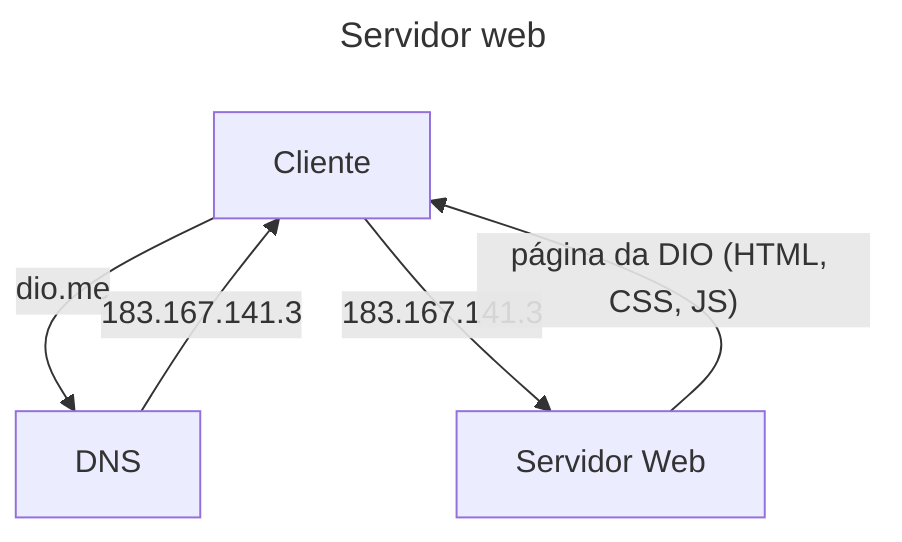

# Criando um Servidor Web com Linux

## Servidor Web

### O que é um servidor WEB

- Quem "ouve" requisições HTTP é um servidor web.



---

- [apache.org](https://apache.org/)

### Instalando o apache2

```bash
apt install apache2
```

- Checamos se o serviço está ativo:

  ```bash
  systemctl status apache2
  ```

- Estando ativo, o serviço apache2 já está recebendo requisições, ou seja, podemos acessar o ip a partir de qualquer computador conectado à rede local.

### Executando aplicações web em um servidor Linux
