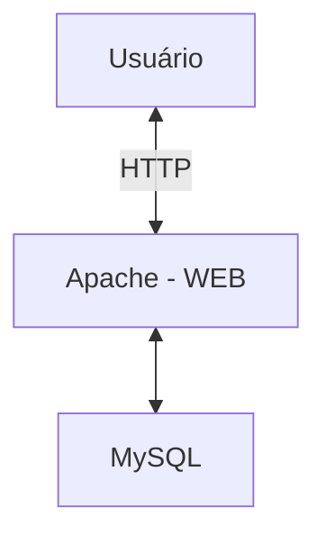

# Servidor de Banco de Dados com Linux

## Servidor de Banco de Dados

### O que é um servidor de banco de dados



### Instalando o MySQL

> O ideal é que você tenha os serviços de servidor de arquivos, servidor web e servidor de banco de dados em computadores diferentes, porque, caso essa máquina tenha algum problema, os três serviços são perdidos. Além disso, com todos o serviços numa mesma máquina, se está sobrecarregando o disco, em termos de requisições.

```bash
apt install mysql-server-8.0
```

- Para usar o banco de dados, há o comando `mysql`. Podemos fazer o logon no banco de dados como usuário root através do comando:

  ```bash
  mysql -u root -p
  ```

- Para mostrar os bancos de dados disponíveis:

  ```bash
  show databases;
  ```

  > Em cada comando dentro do MySQL, é obrigatório o uso de `;` no final, indicando que se está finalizando o comando.

- Para criar um banco de dados:

  ```bash
  create database meubanco;
  ```

- Para usar o banco de dados:

  ```bash
  use meubanco;
  ```

- Para criar uma tabela:

  ```bash
  create table Pessoas (PessoaID int, Nome varchar(50), Sobrenome varchar(50), Endereco varchar(100), Cidade varchar(50));
  ```

- Para ver o que há em uma tabela:

  ```bash
  select * from Pessoas;
  ```

- Para adicionar uma linha a uma tabela:
  ```bash
  insert into Pessoas (PessoaID, Nome, Sobrenome, Endereco, Cidade) VALUES (1, 'Carlos', 'da Silva', 'Av. do Carmo, 500', 'Jaboticabal-SP');
  ```
